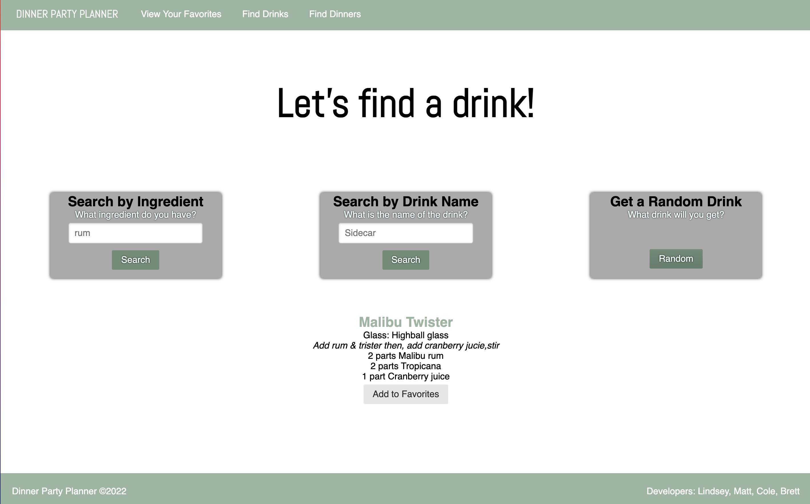

# Dinner Party Planner

The Dinner Party Planner is an interactive website allowing users to explore different meals and drinks. Both the meal and drink page allow the user to search for results by ingredient, by name, or by letting the application randomly find the user a drink or meal. Users also have the option to save their results to their "favorite" page. 

### Overview
- Use a CSS framework other than Bootstrap.
- Be deployed to GitHub Pages.
- Be interactive (i.e., accept and respond to user input).
- Use at least two server-side APIs.
- Does not use alerts, confirms, or prompts (use modals).
- Use client-side storage to store persistent data.
- Be responsive.
- Have a polished UI.

### Built With
* HTML
* Pure CSS
* Javascript
* TheCocktailDB API 
* TheMealDB API 

### Tools Used During Collaboration
* Discord
* Google Slides

### User Story
- As the host of an upcoming dinner party, I want to find interesting drinks and food entrees, so that I can prepare a menu that will impress my friends.
- As a user I want to search for both drinks and food items by things I am familiar with, such as a main ingredient or area of origin.
- I also want to have a recipe to follow, as well as be able to find past recipes so I can make the same items in the future.

### Deployed website
https://mattkolbach.github.io/DinnerPlanner/

### Preview:

### Developers
- Matt: https://github.com/MattKolbach
- Lindsey: https://github.com/lindseymiller2567
- Brett: https://github.com/Besupan
- Cole: https://github.com/ColeVibes

